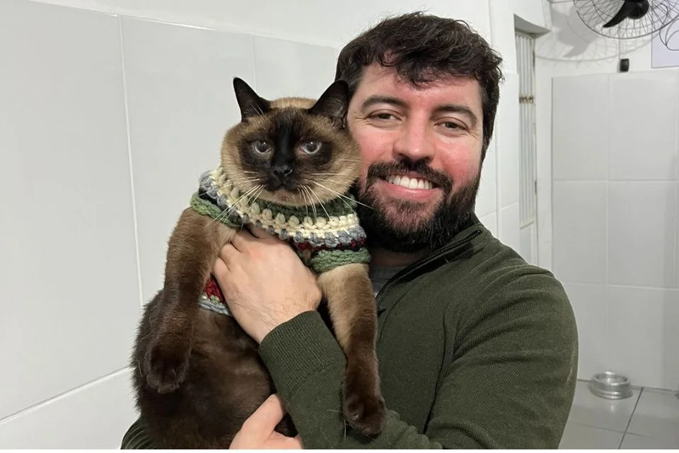
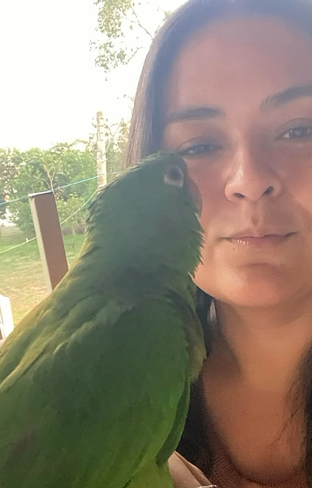

# CLIENTES & CASOS DE CUIDADO

Nossos verdadeiros pacientes e razão de existir são os animais, mas o elo de confiança se constrói com as famílias que confiam suas vidas a nós. Abaixo, compartilhamos histórias reais de quem experimentou a serenidade, a precisão e o acolhimento do nosso espaço.

---

### Casos e Serviços Realizados

* **Milo (Golden Retriever, 4 anos):** Acompanhamento preventivo e check-up anual com foco na saúde articular, além de rotina quinzenal de Spa Calm para controle dermatológico e alívio de alergias sazonais.
* **Amora (Gata sem raça definida, 7 anos):** Diagnóstico rápido por ultrassonografia abdominal para investigação de alterações renais precoces, realizado sem necessidade de sedação, utilizando técnicas gentis de contenção e ambiente silencioso.
* **Pipoca (Spitz Alemão, 2 anos):** Plano integrado de higienização com secadores ultrassilenciosos e dessensibilização a tosa, superando o trauma anterior de banhos barulhentos.

---

### Depoimentos

> "Sempre foi uma batalha levar o Milo ao veterinário; ele tremia só de ver a porta de vidro de outros lugares. Na Pintinho Amarelinho, o silêncio da recepção e a luz suave mudaram tudo. A Dra. Clara atendeu no chão, no ritmo dele, sem pressa. A transparência na explicação dos exames me deu uma paz de espírito que eu nunca tinha sentido antes em uma consulta."
* **Nome do cliente:** Mariana Albuquerque (tutora do Milo)
* **Data do depoimento:** 14 de março de 2026
* **Foto do cliente:**
  
  

---

> "Precisei de um ultrassom de emergência para a Amora e temia o estresse que isso causaria nela, que é extremamente arredia com estranhos. O Dr. Pedro foi impecável: preparou o ambiente, aqueceu o gel do exame e me deixou acariciar a cabeça dela durante todo o procedimento. O diagnóstico foi direto, objetivo e sem rodeios desnecessários. Uma postura ética e séria que faz toda a diferença."
* **Nome do cliente:** Gabriel Zanin (tutor da Amora)
* **Data do depoimento:** 22 de maio de 2026
* **Foto do cliente:**
  
  

---

> "O serviço de estética animal deles é incomparável. A Pipoca tem pânico de barulho de secador e sempre voltava estressada de petshops convencionais. No Spa da Pintinho Amarelinho, o cuidado com o isolamento acústico e a delicadeza no manejo fizeram ela voltar tranquila para casa, com o pelo impecável e sem aquele cheiro forte de perfume barato. Vale cada centavo pela paz dela."
* **Nome do cliente:** Camila Duarte (tutora da Pipoca)
* **Data do depoimento:** 08 de agosto de 2026
* **Foto do cliente:**
  
  