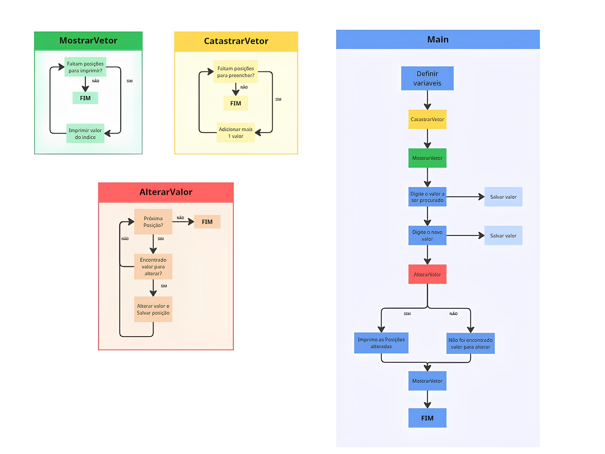

01 Defesa oral: explicar por que o vetor não precisa de return e por que a quantidade de alterações precisa.  

> Os vetores são passados por referência, desta forma a edição do vetor
> ocorre em um escopo superior, não é criado uma copia para edição. já a
> quantidade de alterações é definida dentrro do scopo da propria função
> sendo nescessário o retorno para exportar o valor para um scopo
> superior.

Aos que forem sorteados não precisam entregar uma imagem com a explicação realizada numa folha a mão. 

---
A função **Main** instaincia as váriaveis:
 - **V** - vetor principal *(tipo int)*
 - **N** - tamanho do vetor *(tipo int)*
 - **procurado** - valor a ser procurado *(tipo int)*
 - **novo** - valor a ser salvo atualizando o vetor *(tipo int)*
 - **alteracoes** - quantidade de indices alterados *(tipo int)*

e também instância executa as funções:
 - **CadastrarVetor(V, N)** - Cadastra os valores no vetor (popula o vetor)
 - **MostrarVetor(V, N)** - Imprime todos os valores do vetor
 - **AlterarValor(V, N, procurado, novo)** - Procura o valor no vetor, atualizar o valor encontrado, e retorna quantas edições foram feitas

---
A função **MonstrarVetor(V, N)** realiza uma operação de **FOR/LOOP** iterando e imprimindo o valor de cada umas das posições do vetor, seus parâmetros são:
 - **V** - referência do vetor para editar *(tipo int)*
 - **N** - referência do tamanho do vetor *(tipo int)*

---
A funções **CadastrarVetor(V, N)** realiza uma operação de **FOR / LOOP)** iterando cada uma das posições do vetor, onde irá solicitar o valor a ser salvo inicialmente. Seus parâmetros são:
 - **V** - referência do vetor para editar *(tipo int)*
 - **N** - referência do tamanho do vetor *(tipo int)*

---
A função **AlterarVetor(V, N, procurado, novo)** realiza uma operação de **FOR / LOOP)** iterando cada uma das posições do vetor, buscando nelas o valor salvo **procurado**, ao encontrar este valor, o valor da posição é atualizado, substituído pelo valor **novo**. Seus parâmetros são:
 - **V** - referência do vetor para editar *(tipo int)*
 - **N** - referência do tamanho do vetor *(tipo int)*
 - **procurado** - valor a ser procurado *(tipo int)*
 - **novo** - valor a ser salvo atualizando o vetor *(tipo int)*
 
A função **AlterarVetor(V, N, procurado, novo)**  retorna:
  - **alteracoes** - quantidade de indices alterados *(tipo int)*
---
### FLUXO DE EXECUÇÃO
Ao executar o ponto de entrada **main** a função executa linha a linha:
- instância as variáveis **V - N -  procurado -  novo -  alteracoes**. 
- Executa a função **CadastrarVetor(V, N)**
- Imprime que o vetor completou o cadastro 
- Executa a função **MostrarVetor(V, N)** 
- Imprime Solicitando o valor que deseja buscar para alteração
- Salva o valor a ser pesquisado na variável **procurado**
- Imprime solicitando qual é o novo valor que deseja salvar
- Salva o novo valor a ser salvo **novo**
- Executa a função **AlterarVetor(V, N, procurado, novo)**
- Ao retornar a função **AlterarVetor(V, N, procurado, novo)** seu retorno é salvo na variável **alteracoes**
- Realizado um teste condicional para saber se houve valores alterados no vetor **V**
- Ao confirmar que houve alterações no vetor **V** é impresso: **Foram alteradas *X* posicoes**
- Cao não houve alterações no vetor **V** é impresso: **O valor nao foi encontrado. Nenhuma posicao foi alterada.**
- Após a realização das alterações é impresso o vetor atualizado
- Executando novamente a função **MostrarVetor(V, N)** 